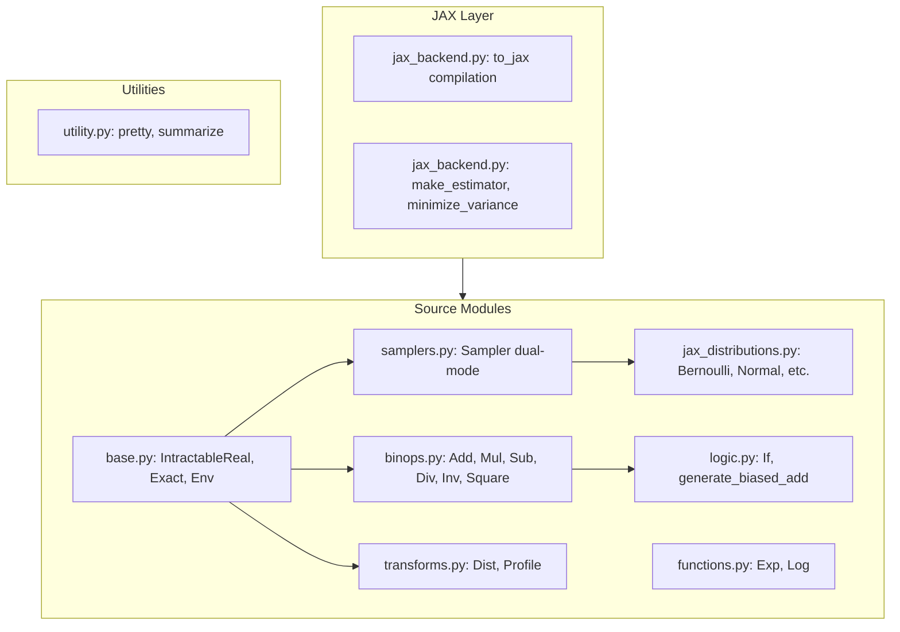

# AutoVar JAX Refactor Plan (Revised)

## Current State

The codebase has everything in [`autovar/dsl.py`](autovar/dsl.py) with manual AD via `estimate_with_grad()` methods that carry `Dict[str, float]` gradients through the computation.

## Target Architecture



---

## Key Design: Dual-Mode Samplers

The refactored `Sampler` supports two modes:

| Mode | Use Case | Performance | Gradient Flow |

|------|----------|-------------|---------------|

| **Legacy** | Python callbacks, external simulators | 1x baseline | Around sampler only |

| **Native JAX** | Standard distributions, production | 10-1000x | Through sampler (reparameterization) |

```python
class Sampler(IntractableReal):
    def __init__(
        self, 
        f: Callable[[], float] = None,      # Legacy Python sampler
        jax_fn: Callable = None,             # Native JAX sampler  
        jax_params: dict = None,             # Parameters for jax_fn
        known_mean: float = None,
        known_variance: float = None,
    ):
        ...
    
    def to_jax(self, env_mapping):
        if self.known_mean is not None:
            return lambda env_array, key: self.known_mean
        
        if self.jax_fn is not None:
            # Fast path: native JAX with key consumption
            return lambda env_array, key: self.jax_fn(key, **self.jax_params)
        
        if self.f is not None:
            # Legacy path: Python callback (no vmap parallelization)
            return lambda env_array, key: jax.pure_callback(
                self.f, jax.ShapeDtypeStruct((), jnp.float64)
            )
```

**Critical**: Legacy mode works for bias optimization because gradients flow around samplers (they're leaf nodes). Native mode additionally enables gradients through distribution parameters.

---

## Phase 1: Setup and Base Types

### 1.1 Create file structure

Create in `autovar/`:

- `base.py` - IntractableReal, Exact, Env
- `samplers.py` - Dual-mode Sampler
- `jax_distributions.py` - Native JAX distribution factories
- `binops.py` - Add, Sub, Mul, Div, Inv, Square
- `functions.py` - Exp, Log
- `logic.py` - If, generate_biased_add
- `transforms.py` - Dist, Profile
- `jax_backend.py` - JAX compilation and optimization

### 1.2 Migrate base types to `base.py`

From [`dsl.py`](autovar/dsl.py) lines 12-56:

- `IntractableReal` base class with abstract `to_jax(env_mapping)` method
- `Exact` class
- `Env` class
```python
class Exact(IntractableReal):
    def to_jax(self, env_mapping):
        val = self.val
        return lambda env_array, key: val

class Env(IntractableReal):
    def to_jax(self, env_mapping):
        idx = env_mapping[self.name]
        return lambda env_array, key: env_array[idx]
```


---

## Phase 2: Dual-Mode Samplers

### 2.1 Create `samplers.py`

```python
class Sampler(IntractableReal):
    _uid_counter = 0

    def __init__(
        self, 
        f: Callable[[], float] = None,
        jax_fn: Callable = None,
        jax_params: dict = None,
        known_mean: float = None,
        known_variance: float = None,
    ):
        self.f = f
        self.jax_fn = jax_fn
        self.jax_params = jax_params or {}
        self.known_mean = known_mean
        self.known_variance = known_variance
        self.uid = Sampler._uid_counter
        Sampler._uid_counter += 1
    
    @property
    def mode(self) -> str:
        if self.jax_fn is not None:
            return "jax"
        elif self.f is not None:
            return "legacy"
        return "constant"
    
    def to_jax(self, env_mapping):
        if self.known_mean is not None:
            mean = self.known_mean
            return lambda env_array, key: mean
        
        if self.jax_fn is not None:
            jax_fn, params = self.jax_fn, self.jax_params
            return lambda env_array, key: jax_fn(key, **params)
        
        if self.f is not None:
            f = self.f
            return lambda env_array, key: jax.pure_callback(
                f, jax.ShapeDtypeStruct((), jnp.float64)
            )
        
        raise ValueError("Sampler has no sampling function")
```

### 2.2 Create `jax_distributions.py`

Native JAX distribution factories for common distributions:

```python
import jax.random as jr
import jax.numpy as jnp
from .samplers import Sampler

def Bernoulli(p, known=True):
    return Sampler(
        jax_fn=lambda key: jr.bernoulli(key, p).astype(jnp.float32),
        known_mean=p if known else None,
        known_variance=p * (1 - p) if known else None,
    )

def Normal(mu, sigma, known=True):
    # Reparameterization trick: mu + sigma * N(0,1)
    return Sampler(
        jax_fn=lambda key: mu + sigma * jr.normal(key),
        known_mean=mu if known else None,
        known_variance=sigma**2 if known else None,
    )

def Uniform(a, b, known=True):
    return Sampler(
        jax_fn=lambda key: jr.uniform(key, minval=a, maxval=b),
        known_mean=(a + b) / 2 if known else None,
        known_variance=(b - a)**2 / 12 if known else None,
    )

def Exponential(rate, known=True):
    return Sampler(
        jax_fn=lambda key: jr.exponential(key) / rate,
        known_mean=1 / rate if known else None,
        known_variance=1 / rate**2 if known else None,
    )
```

---

## Phase 3: Operations with Key Propagation

### 3.1 Binary operations in `binops.py`

All operations must split and propagate PRNG keys:

```python
class Add(IntractableReal):
    def to_jax(self, env_mapping):
        left_fn = self.x.to_jax(env_mapping)
        right_fn = self.y.to_jax(env_mapping)
        
        def jax_add(env_array, key):
            k1, k2 = jax.random.split(key)
            return left_fn(env_array, k1) + right_fn(env_array, k2)
        return jax_add

class Mul(IntractableReal):
    def to_jax(self, env_mapping):
        left_fn = self.x.to_jax(env_mapping)
        right_fn = self.y.to_jax(env_mapping)
        
        def jax_mul(env_array, key):
            k1, k2 = jax.random.split(key)
            return left_fn(env_array, k1) * right_fn(env_array, k2)
        return jax_mul

class Inv(IntractableReal):
    def to_jax(self, env_mapping):
        inner_fn = self.x.to_jax(env_mapping)
        return lambda env_array, key: 1.0 / inner_fn(env_array, key)
```

### 3.2 Functions in `functions.py`

```python
class Exp(IntractableReal):
    def to_jax(self, env_mapping):
        inner_fn = self.x.to_jax(env_mapping)
        return lambda env_array, key: jnp.exp(inner_fn(env_array, key))

class Log(IntractableReal):
    def to_jax(self, env_mapping):
        inner_fn = self.x.to_jax(env_mapping)
        return lambda env_array, key: jnp.log(inner_fn(env_array, key))
```

### 3.3 Control flow in `logic.py`

`If` uses soft semantics (evaluates both branches) for differentiability:

```python
class If(IntractableReal):
    def to_jax(self, env_mapping):
        cond_fn = self.cond.to_jax(env_mapping)
        then_fn = self.if_expr.to_jax(env_mapping)
        else_fn = self.else_expr.to_jax(env_mapping)
        
        def jax_if(env_array, key):
            k1, k2, k3 = jax.random.split(key, 3)
            p = cond_fn(env_array, k1)
            # Soft If: weighted sum for differentiability
            # (matches existing estimate_with_grad behavior)
            return p * then_fn(env_array, k2) + (1 - p) * else_fn(env_array, k3)
        return jax_if
```

**Note**: This differs from `estimate()` which samples one branch, but matches `estimate_with_grad()` semantics.

---

## Phase 4: Transforms

### 4.1 `Dist` in `transforms.py`

```python
class Dist(IntractableReal):
    def to_jax(self, env_mapping):
        inner_fn = self.dist.to_jax(env_mapping)
        n = self.n
        
        def jax_dist(env_array, key):
            keys = jax.random.split(key, n)
            samples = jax.vmap(lambda k: inner_fn(env_array, k))(keys)
            return jnp.mean(samples)
        return jax_dist
```

### 4.2 `Profile` wrapper

Profile is for Python-side timing; in JAX mode, it becomes a passthrough:

```python
class Profile(IntractableReal):
    def to_jax(self, env_mapping):
        # JAX mode: profiling handled externally (jax.profiler)
        return self.x.to_jax(env_mapping)
```

---

## Phase 5: JAX Backend

### 5.1 Create `jax_backend.py`

```python
import jax
import jax.numpy as jnp
import jax.random as jr
import warnings

def get_env_mapping(program):
    """Extract all Env variable names and create name->index mapping."""
    from .utility import get_environment_dependencies
    names = sorted(get_environment_dependencies(program))
    return {name: idx for idx, name in enumerate(names)}

def has_legacy_samplers(program):
    """Check if program contains any legacy Python samplers."""
    from . import Sampler
    # Walk AST and check sampler modes
    ...

def make_estimator(program, n_samples=1000):
    """Compile program to JAX estimator with automatic gradients."""
    env_mapping = get_env_mapping(program)
    jax_fn = program.to_jax(env_mapping)
    
    if has_legacy_samplers(program):
        warnings.warn(
            "Program contains legacy Python samplers. "
            "Use JAX-native distributions for better performance."
        )
    
    def estimate_mean(env_array, key):
        keys = jr.split(key, n_samples)
        samples = jax.vmap(lambda k: jax_fn(env_array, k))(keys)
        return jnp.mean(samples)
    
    estimate_jit = jax.jit(estimate_mean)
    grad_jit = jax.jit(jax.grad(estimate_mean, argnums=0))
    
    return estimate_jit, grad_jit, env_mapping

def minimize_variance(program, base_env={}, iterations=1000, lr=1e-2, lr_decay=0.99):
    """Optimize bias parameters to minimize variance-of-variance using JAX."""
    variance_prog = program.variance(adaptive=True)
    var_var_prog = variance_prog.variance()
    
    estimate_fn, grad_fn, env_mapping = make_estimator(var_var_prog)
    
    # Build initial env array
    names = sorted(env_mapping.keys())
    env_array = jnp.array([base_env.get(k, 0.5) for k in names])
    
    # SGD optimization loop
    for i in range(iterations):
        key = jr.PRNGKey(i)
        grads = grad_fn(env_array, key)
        env_array = env_array - lr * grads
        env_array = jnp.clip(env_array, 0.02, 0.98)
        lr *= lr_decay
    
    return {name: float(env_array[idx]) for name, idx in env_mapping.items()}
```

---

## Phase 6: Update Imports and Cleanup

### 6.1 Update `autovar/__init__.py`

```python
from .base import IntractableReal, Exact, Env
from .samplers import Sampler, NamedCallable
from .jax_distributions import Bernoulli, Normal, Uniform, Exponential
from .binops import Add, Sub, Mul, Div, Inv, Square
from .functions import Exp, Log
from .logic import If, generate_biased_add
from .transforms import Dist, Profile
from .jax_backend import make_estimator, minimize_variance, get_env_mapping
from .utility import pretty, summarize, get_environment_dependencies, check_deterministic
```

### 6.2 Update `utility.py`

- Remove `minimize_variance()` (moved to jax_backend.py)
- Keep `pretty()`, `get_environment_dependencies()`, `summarize()`, `check_deterministic()`

### 6.3 Archive legacy code

- Rename `dsl.py` to `dsl_legacy.py` for reference
- Delete after migration verified

---

## Capability Summary

| Capability | Legacy Samplers | Native JAX Samplers |

|------------|-----------------|---------------------|

| JIT compilation | Partial | Full |

| vmap parallelization | Serialized | Parallel |

| GPU/TPU execution | CPU only | Hardware accelerated |

| Gradients through sampler | Zero (leaf node) | Reparameterization trick |

| Gradients around sampler | Works | Works |

| Arbitrary Python code | Yes | No |

| External simulators | Yes | No |

| Expected speedup | 1x | 10-1000x |

---

## Dependencies

Add to `setup.py`:

```python
install_requires=[
    "jax",
    "jaxlib",
]
```

---

## Testing Strategy

1. Verify each node's `to_jax()` output matches legacy `estimate()` for same random seed
2. Verify gradients are non-zero and match manual chain-rule results
3. Compare `minimize_variance()` results between legacy and JAX implementations
4. Benchmark: measure speedup for native vs legacy samplers
5. Run all demo notebooks with new API